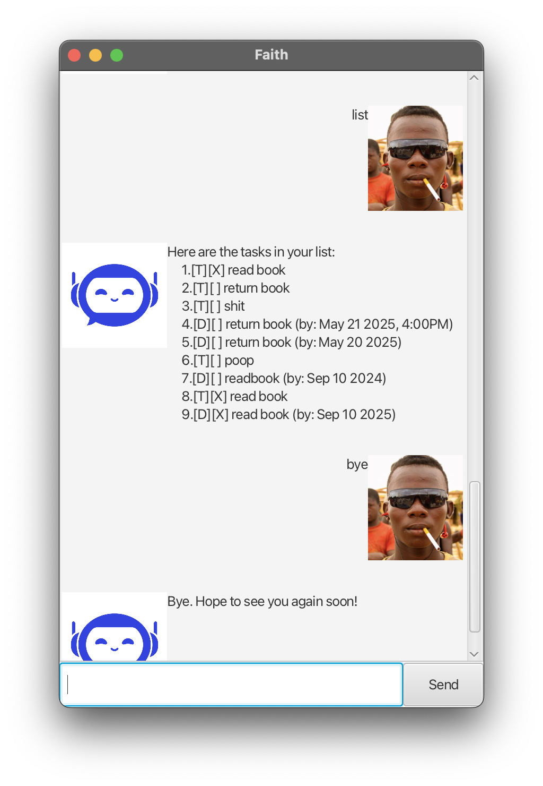

# Duke User Guide

// Update the title above to match the actual product name

// Product screenshot goes here

// Product intro goes here

## Adding deadlines

// Describe the action and its outcome.

// Give examples of usage

Example: `keyword (optional arguments)`

// A description of the expected outcome goes here

```
expected output
```

## Feature ABC

// Feature details


## Feature XYZ

// Feature details


# User Guide for Faith

Welcome to **Faith**, your personal task manager chatbot.  
Faith helps you keep track of tasks, deadlines, and events — all from a simple chat interface.



---

## Quick Start

1. **Launch the app**
    - Run the JAR file with `java -jar faith.jar`.
    - A GUI window will open.

2. **Type a command** in the text field and hit **Enter** or click **Send**.

3. **Faith will respond** in the chat window.

4. **Exit the app** using the `bye` command or close the chat window. Your tasks are saved automatically.

---

## Features

### 1. Viewing all tasks: `list`
Shows all the tasks in your list.

**Example:**
list

---

### 2. Adding a todo: `todo`
Adds a task without a date.

**Format:**  
todo DESCRIPTION

**Example:**
todo read book

---

### 3. Adding a deadline: `deadline`
Adds a task with a due date (and optionally time).

**Format:**  
deadline DESCRIPTION /by DATE [TIME]

- DATE can be in formats like `20/5/2025` or `2025-12-02`.
- TIME is optional, e.g., `1600`.

**Example:**
deadline return book /by 20/5/2025 1800

---

### 4. Adding an event: `event`
Adds a task with a start and end time.

**Format:**  
event DESCRIPTION /from DATE [TIME] /to DATE [TIME]

**Example:**
event team meeting /from 20/5/2025 1400 /to 20/5/2025 1600

---

### 5. Marking/unmarking tasks: `mark` / `unmark`
Marks a task as done or not done.

**Format:**  
mark INDEX  
unmark INDEX

**Example:**  
mark 2  
unmark 4

---

### 6. Deleting tasks: `delete`
Removes a task from the list.

**Format:**  
delete INDEX

**Example:**
delete 3

---

### 7. Finding tasks: `find`
Searches for tasks by keyword.

**Format:**  
find KEYWORD

**Example:**
find book

---

### 8. Editing tasks: `edit`
Update a task without deleting it first. You can change only **one field at a time**.

**Formats:**  
edit INDEX /desc NEW_DESCRIPTION
edit INDEX /by NEW_DATE [TIME] (for deadlines)
edit INDEX /from NEW_DATE [TIME] (for events)
edit INDEX /to NEW_DATE [TIME] (for events)

**Examples:**  
edit 2 /desc read another book  
edit 3 /by 21/5/2025 1800  
edit 4 /to 1/6/2025 1030

---

### 9. Exiting: `bye`
Exits the app. Your tasks are saved automatically.

**Example:**
bye

---

## FAQ

**Q: Where are my tasks saved?**  
A: In the `data/tasks.txt` file in the same folder as the app. They will load automatically next time you run Faith.

**Q: What happens if I type the wrong command?**  
A: Faith will tell you what went wrong and show the correct format.

---

## Command Summary

| Command  | Format (examples)                                       |
|----------|---------------------------------------------------------|
| list     | `list`                                                  |
| todo     | `todo read book`                                        |
| deadline | `deadline return book /by 20/5/2025 1800`               |
| event    | `event meeting /from 20/5/2025 1400 /to 20/5/2025 1600` |
| mark     | `mark 2`                                                |
| unmark   | `unmark 2`                                              |
| delete   | `delete 3`                                              |
| find     | `find book`                                             |
| edit     | `edit 2 desc/ read another book`                        |
| bye      | `bye`                                                   |

---

*End of User Guide*